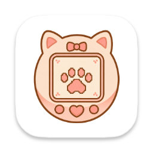

<h1 align="center">
   呆啵宠物  DyberPet<br>
  <sup><sub>Put your favorite characters on your desktop — customize freely, with AI by your side.</sub></sup>
</h1>

<p align="center">
  <b>🐾 Desktop Pet System</b>: animations, interactions, progression, tasks, shop features, and mini pets that make your characters truly live on your desktop.<br>
  <b>✨ AI Assistant</b>: LLM-powered pet interactions for companion chat, to-do management, and daily assistance.<br>
  <b>🧩 MOD Ecosystem</b>: freely extend and create characters, items, sounds, and mini pets.
</p>

<p align="center">
  <a>
    
  </a>

  <a style="text-decoration:none">
    
  </a>

  <a style="text-decoration:none">
    
  </a>

  <a style="text-decoration:none">
    
  </a>
</p>

<p align="center">
English | <a href="README.md">简体中文</a>
</p>

<p align="center">
  <a href="https://github.com/ChaozhongLiu/DyberPet/releases/latest">Try Demo</a> |
  <a href="docs/collection.md">Browse Characters & MODs</a> |
  <a href="docs/art_dev.md">Read MOD Dev Docs</a>
</p>

<p align="center">
  
</p>

## Why Try DyberPet

- More than a pet overlay: it already works as a full desktop pet app with animation, interaction, progression, and task systems.
- Highly moddable: pets, mini pets, items, food, and sounds can all be extended, with JSON-based configuration that is easy to start with.
- AI is optional, not required: connect LLM features for an assistant-like experience, or use it as a complete desktop pet without AI.

## Project Status

- **Latest version: v0.8.5**, with a packaged Windows build available in [Release](https://github.com/ChaozhongLiu/DyberPet/releases/tag/v0.8.5).
- The repository is still maintained primarily in Chinese, but feedback and bug reports are welcome.
- The LLM-related module is still under active development and is not yet fully open-sourced.
- There are reposted mirrors on CSDN / GitCode that are not affiliated with this project. Please use this GitHub repository as the canonical source.

Please leave a ⭐ **STAR** if you like the project and want to follow future updates.

:octocat: We are actively building out the LLM-related features and would welcome more contributors.  
If you are interested in joining, feel free to [message me](https://space.bilibili.com/39307302).


## Try the Demo
### Windows Users
  Download the latest Release，double-click **``run_DyberPet.exe``**, that's it!

### Windows Terminal
  Create a new **conda** environment 
  ```
  conda create --name Dyber_pyside python=3.9.18
  conda activate Dyber_pyside
  conda install -c conda-forge apscheduler
  conda install -c conda-forge pynput
  pip install PySide6-Fluent-Widgets==1.5.4 -i https://pypi.org/simple/
  pip install pyside6==6.5.2
  pip install tendo
  ```
  Download the repository，then run **``run_DyberPet.py``**.
  
### MacOS Users
  Create a new **conda** environment  
  ```
  conda create --name Dyber_pyside python=3.9.18
  conda activate Dyber_pyside
  conda install -c conda-forge apscheduler
  pip install pynput==1.7.6
  pip install PySide6-Fluent-Widgets==1.5.4 -i https://pypi.org/simple/
  pip install pyside6==6.5.2
  pip install tendo
  ```
  Download the repository，then run **``run_DyberPet.py``**.


## User Manual
(Under construction)


## Developer Manual
(English version under construction)


## Acknowledgement
- Pictures in the Demo partially come from [daywa1kr](https://github.com/daywa1kr/Desktop-Cat)
- Animation module reference: [yanji255](https://toscode.gitee.com/yanji255/desktop_pet/)  
- Dragging and falling reference: [WolfChen1996](https://github.com/WolfChen1996/DesktopPet)

