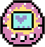
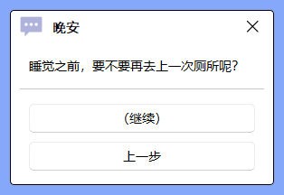
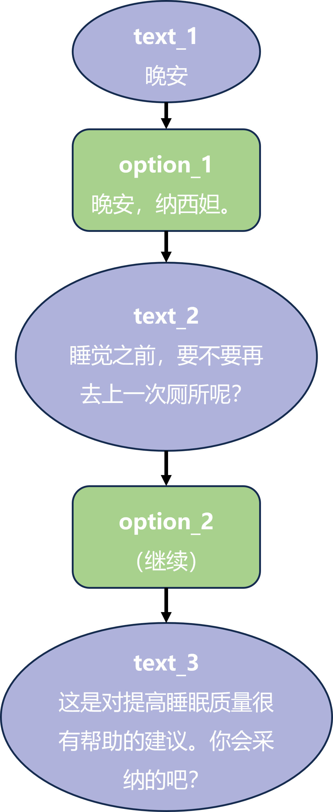
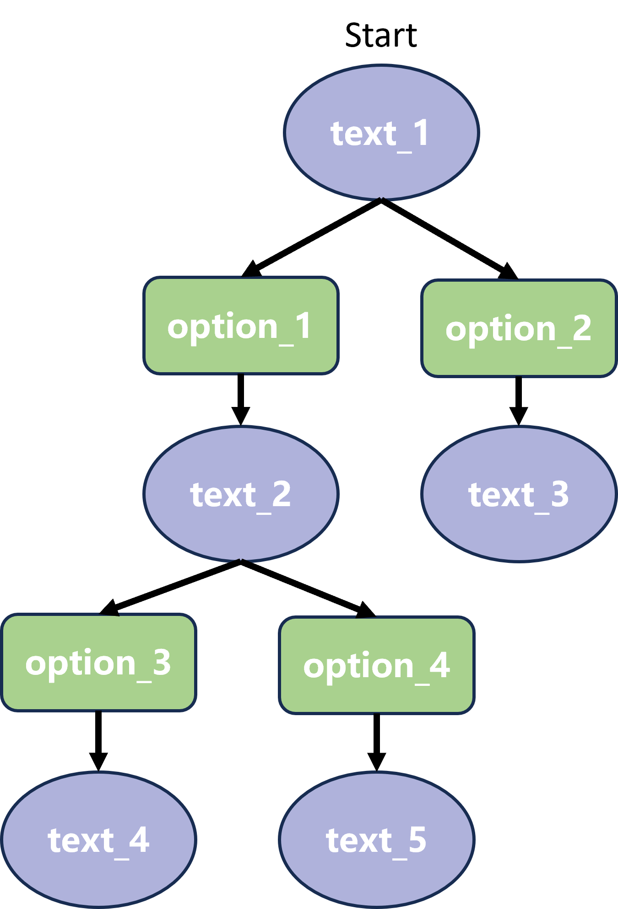

# 素材开发文档
素材开发文档，是想要在「呆啵宠物」现有功能下，开发新的宠物形象、动作等美术素材，所需要参考的标准和指南。
目前包括三个部分：
- 角色开发：角色相关的动画、属性
- 物品开发：食物、收藏品等
- 迷你宠物开发：迷你宠物的动画、属性

开始之前，有一些注意事项:
- 文件名请使用英文命名，目前已知一些繁体中文地区解压素材会导致乱码和程序崩溃
- 开发过程中的测试可以使用 ``系统`` 内对应模组的自动添加功能，程序会检查模组文件夹并给出潜在的错误提示
- 任何模组的开发后，都请仔细测试后再发布

## 目录
- [角色开发](#角色开发)
  - [动画播放实现原理](#动画播放实现原理)
  - [桌宠开发相关文件列表](#桌宠开发相关文件列表)
  - [桌宠参数文件](#桌宠参数文件)
  - [动作参数文件](#动作参数文件)
  - [个性化通知系统](#个性化通知系统)
  - [桌宠及作者信息](#桌宠及作者信息)
  - [桌宠开发流程](#桌宠开发流程)
- [物品开发](#物品开发)
  - [物品参数文件](#物品参数文件)
  - [物品模组及作者信息](#物品模组及作者信息)
- [对话类物品及相关配置](#对话类物品及相关配置)
- [迷你宠物开发](#迷你宠物开发)


## 角色开发  
### 动画播放实现原理 
(可以不看)  
  
0. 动画在两个模块中被调用
   - **动画模块**：独立于桌宠的主界面运行，不会出现因加载动画而出现程序未响应的情况。用户与桌宠交互时，动画模块会暂停等待，优先级处于末位。  
   - **交互模块**：用于即时响应用户的各种交互行为，桌宠状态变化时的行为。

  
1. 程序启动时，将读取 ``data/role`` 中的所有文件夹，判定并获取角色列表  
  
2. 之后，主程序开始加载有关桌宠的各项参数。以角色 ``Kitty`` 为例  
   主程序将寻找
   - 桌宠参数文件：``res/role/Kitty/pet_conf.json``
   - 动作参数文件：``res/role/Kitty/act_conf.json``  

   加载各项参数初始化桌宠。  
  
3. 当动作被调用时，如 ``stand`` 动作，程序则会按一定 ``时间间隔``、依次，显示位于 ``res/role/Kitty/action/`` 中所有的 ``stand_*.png`` 图片，以实现 GIF 的效果。顺序为 ``stand_0.png``、``stand_1.png``、``stand_2.png``、......  
  
   若动作包含移动，如 ``left_walk`` 动作，程序则会在每次更新图片时，依据 ``移动方向``、``单位时间间隔移动距离``，移动整个桌宠。  
  
上述行为中的图片，则是所需开发的动画素材；提及的的时间、距离等，则是素材开发时需要添加在 ``res/role/Kitty/act_conf.json`` 的动作参数。

### 桌宠开发相关文件列表
一个桌宠角色的文件夹包含了如下文件：
```
桌宠名字/
│ 
├── act_conf.json                         # 动作参数文件定义了桌宠所有动作的配置
│ 
├── pet_conf.json                         # 桌宠参数文件定义了桌宠包括动画在内的所有属性的配置
│ 
├── msg_conf.json                         # (可选) 桌宠对话相关的文件，需要与相关物品配合使用
│                                         # 我们将在物品模组部分讲解
│      
├── action/                               # 这个文件夹 保存了桌宠动作的所有 PNG 图片
│   ├── stand_0.png, stand_1.png, ...     # 每个动作的所有图片都有一样的前缀，然后按播放顺序命名为0，1，2，...
│   └── patpat_0.png, ...
│
├── note/                                 # 这个文件夹包含了个性化应用通知系统的所有文件
│   │                                     # 这是一个可选项，如果没有这个文件夹，系统会选择默认的通知系统素材
│   ├── note.json                         # 通过这个配置文件，改变通知的图标、音频
│   ├── icon.png                          # 在配置文件中更改了图标，当然得把文件也给带上
│   ├── morning.wav                       # 同样，更改了音频，就把音频附上
│   ├── random_chat.wav                   # 配置文件里可以添加不限量的随机语音，点击宠物的时候随机播放
│   └── random2.wav                       # 但是不要添加太多，占内存 2333
│
├── info/                                 # 这个文件夹包含了桌宠和作者相关的信息
│   │                                     # 会在 系统-角色管理 的信息窗口中显示
│   │                                     # 虽然是备选项，但强烈建议添加，可以帮你引引流 (后面会有教程)
│   ├── info.json                         # 桌宠和作者信息的配置文件
│   ├── pfp.png                           # 桌宠的头像，会显示在好几处 UI 中
│   ├── author.png                        # 作者的头像，会显示在信息窗口中
│   └── other_picture.jpg/png             # 一些其他图片，会滚动显示在信息窗口的上半部分
│
├── items/                                # (可选) 角色可以自带一些物品
│   ├── items_config.json                 # 设定方法和物品模组一样，会在物品模组部分讲解
│   └── item_img.png, ...

```
  
**接下来我们就逐个介绍这些配置文件。**

### 桌宠参数文件
桌宠参数文件 ``res/role/PETNAME/pet_conf.json`` 举例如下：  
  
```
{
  "width": 98,              # 所有 PNG 图片的最大宽度
  "height": 98,             # 所有 PNG 图片的最大高度
  "scale": 1.0,             # 图片显示比例，会影响宠物大小、单位时间移动距离
  "interact_speed":0.02,    # 交互模块的响应刷新间隔，0.02s 是较为理想的间隔，不需要修改


  "default": "breath",      # 此处定义了一些必要动作，所有这些动作名字，都需要在 act_conf.json 中定义
  "up": "up",               # 但目前只有 default (静息动作)、left (向左走)、
                            # right (向右走)、drag (鼠标点击拖拽)、
                            # prefall (鼠标松开时下落预备动作)、fall (自由下落)、
                            # patpat (角色被鼠标单击后)、focus (专注时间) 真正用到
  "down": "down",           # 其他的只是为以后版本所做的拓展
  "left": "left",           # 创建一个角色，必须要至少有 default、drag、fall
  "right": "right",         # 其他动作缺失的情况，程序会自动用 default 动作填补，prefall 会用 fall 填补
  "drag": "drag",           
  "prefall": "prefall"      # 用法例："default": "stand"
  "fall": "fall",           # 定义 default 动作为 动作参数文件中 名为 "stand" 的动作
  "focus": "focus",         # 专注动画，当开始专注时间时，会仅播放专注动画

  "patpat": {'0':'patpat0', '1':'patpat1','2':'patpat2','3':'patpat3'}
  # 拍拍动作的定义方式略有不同，如果你的角色只有一个拍拍动作，那么像前面的一样，写一个动作的名字就可以了
  # 但如果你给不同的饱食度等级定义了不同的动作，就用上面的方式定义，当然，你也可以写成：
  # {'0':'patpat', '1':'patpat','2':'patpat','3':'patpat'} (所有饱食度等级都为同一个动作)
  

  # random_act 把动作进行组合形成一个完整动画，用于在动画模块中随机展播放，或在右键菜单中选择进行播放
  "random_act": [
    # 下面是一个动画例子
    {"name": "左右行走",                                    # 动画的名字
     "act_list": ["left_walk", "right_walk","default"],    # 动画会顺序播放如下定义好的动作
     "act_prob": 0.1,                                      # 动画的随机播放概率
     "act_type": [3,1]},                                   # 动画的状态类型 [3,1] 是指：
                                                           #     动作是一个饱食度等级为【活力】的动作 (影响播放概率的计算)
                                                           #     动作在好感度 1 级时解锁

    # 建议制作一个 act_type = [0, 0] 的动作，这样角色饱食度为 0 时（饿昏状态），就只会播放 “睡觉” 这个动作了
    {"name":"睡觉", "act_list":["fall_asleep", "sleep"], "act_prob":0.05, "act_type":[0,0]},

    # 除了这些常规动作，还有4个内部使用的特殊动作名称
    # 请不要占用这些名称，这些动画也不会在动作列表中显示
    # 可以注意到，这些动作的 act_type 是 [0, 100000]，我用此来表示这个是特殊动作
    # feed_1,2,3 是吃到不同喜好食物后的反应，定义 "sound" 还可以播放语音 (语音在后面的通知个性化部分讲解)
    # on_floor 是角色落地瞬间的落地动作

    {"name":"feed_1", "act_list":["feed_1"], "act_prob":0, "act_type":[0,10000], "sound":["feed_1"]},
    {"name":"feed_2", "act_list":["feed_2"], "act_prob":0, "act_type":[0,10000], "sound":["feed_2"]},
    {"name":"feed_3", "act_list":["feed_3"], "act_prob":0, "act_type":[0,10000], "sound":["feed_3"]},
    {"name":"on_floor", "act_list":["on_floor"], "act_prob":0, "act_type":[0,10000]}
  ],
  


  # accessory_act 定义了一系列拥有【组件】的动画，有的可以随机播放、有的只能在动作列表中主动选择进行展示
  # 可以把这种组件动作理解成桌宠的额外特效
  "accessory_act":[
    # 下面定义了纳西妲的 E 技能
    {"name":"E技能", 
     "act_list":["e_skill1","e_skill2","e_skill2","e_skill3"],       # 动作列表，需要定义在 act_conf.json 中
     "acc_list":["photo_frame_1","photo_frame_2","photo_frame_3"],   # 组件动画列表，同样需要定义在 act_conf.json 中
     "act_type":[2,2],                                               # 动画的状态类型，与随机动作一致
     "follow_mouse": true,                                           # 组件是否跟随鼠标，这里实现了鼠标控制照像框组件
     "above_main":false,                                             # 暂时没用的属性，可以不管
     "anchor":[145,145]},                                            # anchor 是【组件的左上角】的相对位置坐标
                                                                     # 如果组件跟随鼠标，则是相对鼠标位置的坐标
                                                                     # 如果不跟随，则是相对桌宠【底边中心】的左边
                                                                     # [145, 145] 指的是相对指针/桌宠，
                                                                     # 向右移动 145，向下移动 145
                                                                     # 这样就能确保组件在正确的位置出现啦

    # 下面定义了纳西妲的 Q 技能，使用后纳西妲做出动作，同时出现摩耶之殿，这是一个不跟随鼠标的组件动作
    {"name":"Q技能", "act_list":["qskill"], "acc_list":["palace_1","palace_2","palace_2","palace_3"], "act_type":[2,2],
    "follow_mouse": false, "above_main":false, "anchor":[-445,-501]}
  ],
  
  # 宠物的物品喜爱度 （特别喜欢 / 一般 / 讨厌）
  # 喂食这些物品后会出现不同的动作：feed_1、feed_2、feed_3
  "item_favorite": {"薯条"：2.0}, # 物品名称：好感度倍率
  "item_dislike": {"汉堡"：0.5}
}
```

#### 各项参数详情
| 名称   | 类型         | 默认值      | 备注                  |
|:-----|:-------------|:----------|:----------------------|
| width | integer | 128 | 如果图片宽度超出了128，请务必提供所有图片的最大宽度 |
| height | integer | 128   | 如果图片高度超出了128，请务必提供所有图片的最大高度 |
| scale | float | 1.0   | 图片显示比例，会影响宠物大小、单位时间移动距离 |
| interact_speed | float | 0.02   | 单位为秒 |
| default, up, ... | str | 无   | 这些默认动作一定要写在 pet_conf.json 中，具体见上面的例子|
| patpat | str/dict | default 动作   | 拍拍动作在不同饱食度分级可定义不同动作，具体写法见上面的例子|
| random_act | list | [ ] |  每一个动作组都是一个dict (被{ } 包起来)，包含所有随机动画的名字、动作列表、概率、和状态阈值。空列表会让动画模块运行异常，不建议一个动作也不定义。具体定义方法见上面的例子 |
| name | str | 无 | 动作组的名字，会显示在右键菜单中以供用户选择。如果没有，则不会在菜单中出现 |
| act_list | str list | 无 | 按定义好的顺序，列出动作的名字 |
| act_type | int list | [2,1] | 动画的状态阈值，例如 [2,1] 中， 2代表饱食度分级为2时触发概率最大，1代表好感等级要大于等于1才能解锁 |
| act_prob | float | 0.2 | 动画在 **定义的饱食度分级下** 的随机播放概率，所有动作组概率之和不必为1，只是一个相对大小，程序会处理一切 |
| accessory_act | list | [ ] |  每一个动作组都是一个dict (被{ } 包起来)，包含所有随机动画的名字、动作列表、概率、和状态阈值。空列表会让动画模块运行异常，不建议一个动作也不定义。具体定义方法见上面的例子 |

#### 饱食度分级与动画随机触发概率
假设一个动画 (random_act, accessory_act) 在其定义的饱食度状态下，概率为 a  
桌宠在不同的饱食度等级下，各个动画的播放概率为：

| 动作的定义状态 \ 当前饱食度   | 3   | 2  | 1  | 0 |
|:-----|:-------------|:----------|:----------------------|:----------------------|
| 3（活跃 hp>80）   | a    | a/4   | a/16   | 0 |
| 2（正常 hp>50）  | a/4    | a   | a/4   | 0 |
| 1（饥饿 hp>0）  | 0    | 0   | a   | 0 |
| 0（饿昏 hp=0）   | 0    | 0   | 0   | a |
  
这样可以实现，饱食度高时宠物很有活力，随着饱食度下降，大概率做一些其他动作，饿昏状态下还可以只播放一个动作
  
  
### 动作参数文件
动作参数文件 ``res/role/PETNAME/act_conf.json`` 举例如下：
```
{
  "default": {               # 动作名，对应在宠物参数文件中 "default": -> "default" <-
    "images": "stand",       # PNG 文件前缀，这里指的是所有 stand_0.png, stand_1.png, etc.
    "act_num": 1             # 动作次数，所有的 PNG 图片按次序重复展示的次数
  },                         # 其他没有定义的参数会在加载时自动取默认数值，stand 动作没有移动效果，不需要其他参数，忽略即可
  
  "right": {                 # 这里，定义为 right 的动作仍然是 stand为前缀的所有PNG文件
    "images": "stand",
    "act_num": 1
  },

  "left_walk": {             # left_walk 是用户自己定义的一个需要移动的动作
    "images": "leftwalk",
    "act_num": 5,            # 动作次数的定义减轻了图片存储的内存压力，只需载入一个循环，即可播放 5 个循环
                             # 比如这里只需要做猫猫前后脚交替的一个循环，即可一直向前移动
                             
    "need_move": true,       # 动作是否需要移动，true为需要移动
    "direction": "left",     # 移动的方向，可为 "left", "right"
    "frame_move": 0.5,       # 单位时间间隔 移动距离
    "frame_refresh": 0.2     # PNG 图片替换的时间间隔，即单帧刷新时间
  },

  "sleep": {
    "anchor": [0, 36],       # anchor 是为了实现透明的动画窗口固定的情况下
    "images": "sleep",       # 播放的图片可以有无法在图片中实现的平移
    "act_num": 5,            # 比如这里定义了纳西妲睡觉的动作，图片已经画到了图层的底边
    "frame_refresh": 0.06    # 但是如果你尝试删除 anchor，再播放这个动画，会发现纳西妲悬浮在任务栏上
  }                          # 但添加一个 anchor [0, 36]，会让图片无视系统定义的地面(任务栏)
                             # 向下平移 36 像素，睡觉的动作就更加自然
} 
```
  
可按上述结构任意添加动作动画、组件动画，增加到桌宠参数文件的 random_act、accessory_act 中  
  
#### 关于动作图片的注意事项
1. 动作对应每一帧的图片为透明背景的 PNG 图片
2. 所有图片保存在 ``res/role/宠物名字/action`` 中
3. 请将每个动作对应每一帧的图片命名为：``相同前缀_*.png``，* 为从 0 开始的序号。例如 ``stand_0.png``, ``stand_1.png``, ``stand_2.png``, ...
4. 请保证所有图片中，宠物的绝对大小（所占像素点数）是相同的

#### 关于 Anchor 参数
Anchor 参数是为了不同动作之间播放的连贯性、避免出现角色切换动作时，突然整体闪现的问题。  
  
**那么应该如何确定每个图片的 Anchor 呢？**  
1. 请给你的角色设定一个 ``底部中心``，例如，两脚中间的一个点、角色中轴线底部
2. 所有动作、所有图片，都以这个点为 ``底部中心``
3. 确认角色的 ``底部中心`` 是否位于 图片的 ``底边中点``
    - 是：那么不用填写 anchor 参数了
    - 否：计算角色的 ``底部中心`` 和 图片的 ``底边中点`` 之间的像素水平和垂直距离 x, y  
      anchor = [x,y]  
      当 ``底部中心`` 需要右移时，x 为正数，反之为负数  
      当 ``底部中心`` 需要下移时，y 为正数，反之为负数  
  


#### 动作参数
| 名称   | 类型         | 默认值      | 备注                  |
|:-----|:-------------|:----------|:----------------------|
| images | str | 无 | 将动作帧按顺序排列为 ``images_0.png``, ``images_1.png``, etc. |
| act_num | integer | 1 | 将 ``images_0.png``, ``images_1.png`` 等按顺序执行 N 次 |
| need_move | Boolean | false | 动作是否需要移动 |
| direction | str | None | 移动的方向，可为 left, right, up, down |
| frame_move | float | 10.0 | 单位时间间隔移动距离 |
| frame_refresh | float | 0.5 | 单位为秒，！强烈建议所有动作的单帧时长都是一样的，这保证用户自定义动作不会出错 |
| anchor | List | [0,0] | 相对于宠物的固定位置，无视系统定义的边界，继续水平 (+ 向右 - 向左) 和垂直 (+ 向下 - 向上) 平移 |
  
  
  
### 个性化通知系统
通知系统允许将系统通知音效、系统通知图标根据角色进行个性化替换，同时也是语音的管理系统。  
  
文件夹中包含必须的配置文件 ``note.json`` 和对应的音频和图片素材。  
``note.json`` 一个示例如下：
```
{
  "通知类型": {
    "image": "nxd.png",      # 通知的图标
    "sound": "feed3.wav",    # 通知的音效/语音
    "sound_priority": 1      # 语音的优先级
  }
}
```

呆啵宠物程序中设定了多种通知类型可以进行个性化配置：  
| 通知类型   | 解释 | 默认图标   | 默认语音  | 默认优先级  |
|:-----|:--------|:--------|:-------|:-------|
| system | 任何和系统相关的通知，例如软件更新提醒 |  | ``res/sound/notification.wav`` | 0 |
| status_hp/fv/coin | 和数值相关的通知，hp/fv/coin 对应 饱食度、好感度、啵币 | 数值对应图标 | ``res/sound/notification.wav`` | 0 |
| clock_tomato/focus | 和专注任务相关的通知，tomato/focus 对应 番茄钟和专注时间 | 任务对应图标 | ``res/sound/notification.wav`` | 0 |
| greeting_1/2/3/4/5 | 启动角色时的问候语音，1/2/3/4/5 对应 早安/午安/下午/晚安/深夜 |  | ``res/sound/notification.wav`` | 0 |
| feed_1/2/3 | 喂食时的语音，1/2/3 对应 喜爱/普通/一般 |  | ``res/sound/notification.wav`` | 2 |
| random_1/2/3/... | 单击桌宠时的随机语音，可以添加无限个 (但会增加内存)，按顺序编号即可 | 无通知框 | 无 | 0 |

几个重要的说明：  
1. 每个通知类型都有默认素材，也就是说个性化的 note.json 只需要添加想改变的通知素材就可以了  
2. 优先级对应的数字越大，优先级越高。喂食语音优先级默认最高，比如有随机语音正在播放，但是突然喂食，语音就会切换  
3. random_* 对应随机语音，可以一个也不添加，不会影响程序正常运行。建议添加一些角色相关的语音
4. 配置了一个通知后，请别忘记在 ``note`` 文件夹添加相应的素材
  
下面是纳西妲个性化通知系统的配置文件示例：  
```
{
  "system":{                           # 不改变系统通知声音，仅改变图标
    "image": "nxd.png"
  },
  "greeting_1": {                      # 个性化了早安语音和图标，没有改变语音优先级
    "image": "nxd.png",
    "sound": "11.wav"
  },
  "feed_1": {                          # 个性化了吃到喜爱的食物是的语音和图标
    "image": "nxd.png",
    "sound": "feed1.wav"
  },
  "random_1": {                        # 添加了一个单击时的随机语音
    "sound": "关于我们-故事会.wav",     # 并将优先级设置为了 1
    "sound_priority": 1                # (高于系统通知，低于喂食语音)
  },
  "random_2": {                        # 添加了第二个随机语音
    "sound": "闲聊-心事.wav",
    "sound_priority": 1
  }
}
```

### 桌宠及作者信息
桌宠及作者信息会显示在 系统 - 角色管理 - :information_source: 中，这个组件包含：  
- 若干张封面图片
- 角色的相关标签
- 角色的文字介绍
- 作者的头像和名字
- 作者的个人主页链接
  
``info`` 文件夹包含 ``info.json`` 及相关素材，``info.json`` 的示例如下：  
```
{
    "coverImages": ["cp0.jpg","cp3.jpg"],            # 添加若干张封面图片
    "pfp":"nxd.jpg",                                 # 角色的头像
    "petName": "纳西妲",                              # 角色的名字
    "tages": {                                       # 自定义一些标签的文字和颜色
        "原神":"#C5E0B4",                            
        "附属宠物":"#BDD7EE",
        "语音":"#FFE699"
    },
    "intro": "纳西妲，《原神》中的角色。",              # 角色的文字介绍
    "author":{                                       # 作者相关信息
        "name":"栎咕咕",                              # 作者名字
        "pfp":"cgg.png",                             # 作者的头像
        "frameColor":"#8FAADC",                      # 头像框的颜色
        "links":{                                    # 填入个人主页的 ID
            "BiliBili":"14004864",
            "爱发电":"12345"
        },
        "infos":"这里是可以随意填写的更多信息"          # 右键停留在作者头像上时显示的文字
    }
}
```
*请确保配置文件中提及的相关素材图片都在 ``info`` 文件夹中  
  
下面是关于各项配置的具体信息：  
| 名称   | 具体解释 |
|:-----|:--------|
| coverImages | 可以添加任何图片，比如角色的预览、图标等 |
| pfp | 角色的头像，会显示在程序的多个组件中，但即使缺少，程序也能正常运行 |
| petName | 角色的名字，请尽量不要带有特殊字符、不要超过 10 个字 |
| tages | 角色模组相关的一些标签，比如 "日语语音" |
| intro | 角色的文字介绍，请在确定最终版本时先测试文字长度是否过长以致无法显示完全 |
| author | author 也是一个 Dict，包含了关于作者的如下信息 |
| author:name | 作者的名字 |
| author:pfp | 作者的头像 |
| author:frameColor | 头像框的颜色 |
| author:links | 个人主页信息。为了安全起见，不允许填入完整网址，而只允许添加指定网站的个人 ID |
| author:infos | 右键停留在作者头像上时显示的文字 |

指定网站的列表如下：  
- BiliBili: ``https://space.bilibili.com/个人ID``
- 微博: ``https://m.weibo.cn/profile/个人ID``
- 抖音: ``https://www.douyin.com/user/个人ID``
- GitHub: ``https://github.com/个人ID``
- 爱发电: ``https://afdian.net/a/个人ID``
- TikTok: ``https://www.tiktok.com/个人ID``
- YouTube: ``https://www.youtube.com/个人ID``


### 桌宠开发流程
（仅为建议）

- 如果是新创建的宠物
  - 在 ``res/role/`` 中新建文件夹，命名为宠物名字
- 设计所有动作并保存为透明背景的 PNG 图片
  - 所有图片保存在 ``res/role/宠物名字/action`` 中
  - 请保证所有图片中，宠物的绝对大小（所占像素点数）是相同的
  - 所有脚部在地面的图片，请保证地面为图片底部，这是为了让宠物显示在正确的位置。
- 将每个动作单元的文件命名为相同前缀 + ``_*.png``，* 为从0开始的次序
- 在 ``res/role/宠物名字/act_conf.json`` 创建动作参数文件，写入每个动作单元
- 在 ``res/role/宠物名字/pet_conf.json`` 创建宠物参数文件
  - 填写各项参数
  - 动作单元编写成动作组，写入宠物参数文件 ``random_act``


  
  
  
## 物品开发  
一个物品模组的文件夹包含了如下文件：
```
模组名字/
│ 
├── info.json                     # 物品模组及作者信息配置文件
│ 
├── items_config.json             # 所有物品的各项参数配置
│ 
├── *.png/jpg/jpeg*               # 物品图片、信息图片等
│ 
```
  
**接下来我们将逐一介绍**

### 物品参数文件

**物品参数文件** ``res/items/NAME/items_config.json`` 举例如下：
```
{
    "苹果": {                                    # 物品的名字
        "image": "apple.png",                    # 物品图片文件
        "effect_HP": 3,                          # 使用后的饱食度加成
        "effect_FV": 3,                          # 使用后的好感度加成
        "drop_rate": 1.0,                        # 单击桌宠随机掉落物品时，此物品的相对权重
        "fv_lock": 0,                            # 解锁该物品的好感度等级
        "description": "爽脆可口的酸甜果实。",     # 对物品的描述文字
        "type": "consumable",                    # 物品的类型
        "fv_reward": [1,2],                      # 物品可作为好感度升级的奖励，这里，升至 1 级和 2 级时都会奖励苹果
        "pet_limit": ["纳西妲"],                 # 物品可以仅限于部分角色获得
        "cost": 200,                             # 物品在商店中的价格
        "buff":{                                 # 物品还可以有 Buff 增益效果
          "effect": "hp",                                    # 增益效果类型
          "interval": 30,                                    # 每 N 秒生效一次
          "value": 2,                                        # 增益的值
          "expiration": 120,                                 # 增益时长
          "description":"使用后每30秒增加2点饱食度，持续2分钟"  # Buff 描述
        }   
    },
    "第二个物品":{
      ...
    }
}
```  
  
**下面是关于各项参数的具体信息：**  
| 名称   | 默认值 | 可选值 | 解释 |
|:-----|:-----|:-----|:-----|
| image       | 必要参数 无默认值 | \ | 物品对应的图片文件，请尽量保证图片为正方形 |
| effect_HP   | 0 | 任意整数 | 使用物品后增加的``饱食度``数值，负数为下降 |
| effect_FV   | 0 | 任意整数 | 使用物品后增加的``好感度``数值，负数为下降 |
| drop_rate   | 0 | 任意实数 | 这是物品掉落概率的相对权重，不必要限制在 1 以内。默认为 0，即不会掉落 |
| fv_lock     | 1 | 0-7任意整数 | 物品将在对应的好感度等级，在商店中解锁
| description | ``""`` | 文本 | 关于物品的描述，填什么都行 |
| type        | ``consumable`` | ``consumable`` \| ``dialogue`` \| ``collection`` \| ``subpet`` | 物品一共有四个类型，将在接下来介绍 |
| fv_reward   | ``[]`` | 0-7 任意整数组成的 List | 物品可作为好感度升级的奖励，建议设计收藏品作为奖励，或者升级时奖励一些食物 |
| pet_limit   | ``[]`` | 角色名字组成的 List | 一般不需要添加这个参数，除非是与某个角色强绑定的物品。角色名字不一定非要在桌宠列表里，随便写，程序会自动过滤 |
| cost        | ``50*(fv_lock+1)`` | 任何大于零的整数 或 -1 | 按照物品的珍惜程度，设定价格(默认价格过于便宜) 。为 -1 时，物品则不会出现在商店里|
| buff        | ``{}`` | \ | buff 的参数配置将在接下来介绍 |

#### 物品类型介绍
呆啵宠物一共有 4 个类型的物品：
- ``consumable``: 消耗品，使用后物品消失
- ``collection``: 收藏品，可以设计一些奖章、角色相关的周边等，作为升级奖励赠送给用户
- ``dialogue``: 对话物品，本质也是 ``collection``收藏品，使用时会打开一个提前写好的、带选项的对话
- ``subpet``: 迷你宠物，迷你宠物本质是一个物品，通过使用召唤出迷你宠物，创建方法将在``迷你宠物开发``部分说明
  
开发 4 个类型的物品，各有其注意事项：  
| 类型   | 注意事项 |
|:-----|:--------|
| consumable | 最普适的一类物品，所有参数均可设计，无需特殊注意 |
| collection | 收藏品点击使用时，不会触发任何效果；因此，无需填写 ``effect_HP, effect_FV``；建议不要填写 ``drop_rate, buff`` |
| dialogue   | 对话物品不应有任何效果，请勿填写 ``effect_HP, effect_FV, buff`` |
| subpet     | 此类物品仅用于召唤迷你宠物，请勿填写 ``effect_HP, effect_FV, drop_rate``, 强烈建议给迷你宠物设计 Buff 效果|
  

#### Buff 系统参数介绍
呆啵宠物一共支持 5 个增益效果，设计是，应分别填写不同的参数：  
| effect 参数   | 解释 | 需要填写的参数 |
|:-----|:-----|:-----|
| hp      | 饱食度的增益效果，``expiration``秒内，每隔``interval``秒，增加``value``点饱食度，负数为减少 | ``effect, value, interval, expiration, description(选填)`` |
| fv      | 好感度的增益效果，``expiration``秒内，每隔``interval``秒，增加``value``点好感度，负数为减少 | ``effect, value, interval, expiration, description(选填)`` |
| coin    | 啵币的增益效果，``expiration``秒内，每隔``interval``秒，增加``value``个啵币 | ``effect, value, interval, expiration, description(选填)``。``value``不可填写负数|
| HP_stop | 停止饱食度的下降，持续 ``expiration``秒| ``effect, expiration, description(选填)`` |
| FV_stop | 在饿昏状态下也能停止好感度下降，持续 ``expiration``秒| ``effect, expiration, description(选填)`` |
  
在最开始时，我们已经举了一个苹果的例子作为【饱食度增益效果】的例子  
我们再举一个【停止饱食度的下降】的例子:  
```
"大力丸": {
    "image": "dlw.png",
    "drop_rate": 0,
    "fv_lock": 1,
    "description": "江湖流传的神秘配方所制。",
    "type": "consumable",
    "fv_reward": [1],
    "cost": 2500,
    "buff":{
      "effect": "HP_stop",
      "expiration": 600,
      "description":"使用后 10 分钟内饱食度不会下降"
    }   
}
```
  
  
### 物品模组及作者信息
模组及作者信息会显示在 系统 - 物品模组 - :information_source: 中，这个组件包含：  
- 模组内所有物品的预览图片和介绍
- 模组的文字介绍
- 作者的头像和名字
- 作者的个人主页链接
  
``info.json`` 的写法与 ``桌宠及作者信息`` 中 ``info.json``的写法一致，  
仅是删除了 ``"coverImages"``。
请参考上面的 ``桌宠及作者信息`` 进行填写。

*请确保配置文件中提及的相关素材图片都在 ``info`` 文件夹中
  
## 对话类物品及相关配置
对话类物品是收藏类型的物品，使用后会触发提前写在 ``res/role/桌宠名字/msg_conf.json`` 中、带选项的对话框。  
实现了文字游戏中经典的【在对话中，选择不同的选项进入不同的分支】的功能。一个示例如下：  
  
  
  
对话类物品实际是与一个角色强绑定的，往往存在于角色文件夹的 ``items/`` 文件夹中，伴随角色的创建一起创建。  
  
创建对话类物品分为三步：    
  
1. 创建物品：创建物品的过程和上述物品模组一致，需要有图片和对应的配置写在 ``res/role/桌宠名字/items/items_config.json`` 中
2. 预设对话内容：配置好 ``res/role/桌宠名字/msg_conf.json`` 文件
3. 在 ``res/role/桌宠名字/pet_conf.json`` 中将物品和 ``msg_conf.json`` 中的对话一一对应
  
### 1. 创建物品
例如，我们创建了一个叫 ``纳西妲的信`` 这样一个对话类物品，**首先要配置物品属性：**  
```
"纳西妲的信":{
    "effect_FV": 0,
    "drop_rate": 0,
    "fv_lock": 2,                   # 2 级解锁
    "fv_reward": 2,                 # 升到 2 级时自动获取
    "type": "dialogue",             # 对话类型物品
    "description": "纳西妲的来信",
    "image": "纳西妲的信.png",
    "pet_limit": ["纳西妲"]         # 仅限角色纳西妲可以获得这个物品
},
``` 
  
### 2. 配置对话的具体内容
**下一步，我们配置对话的具体内容。**  
``res/role/桌宠名字/msg_conf.json`` 的示例如下：
```
{
    "对话1":{                                                        # 对话的名字
        "title": "晚安",                                             # 对话框的标题
        "start": "text_1",                                           # 最开始对话框显示什么，这里对应的是一段文字的 Key
        "text_1": "晚安。",                                          # 文字 "晚安。" 对应的 Key 就是 "text_1"
        "text_2": "睡觉之前，要不要再去上一次厕所呢？",                 # 所有的对话框文字都以 "text_编号" 作为 Key
        "text_3": "这是对提高睡眠质量很有帮助的建议。你会采纳的吧？",
        "option_1": "晚安，纳西妲。",                                 # 所有的对话框选项都以 "option_编号" 作为 Key
        "option_2": "（继续）",
        "relationship": {                                            # relationship 定义了文字和选项之间的关系
            "text_1": ["option_1"],                                  # 我们将在下面详细讲解
            "text_2": ["option_2"],
            "option_1": ["text_2"],
            "option_2": ["text_3"]
        }
    },

    "下一个对话"{
      ......
    }
}

```
现在，你应该知道，一个对话的配置包含了几个元素：
- ``title``
- ``start``
- 所有文字及其对应的 Key：``"text_编号": "文字内容"``
- 所有选项及其对应的 Key：``"option_编号": "选项内容"``
- ``relationship``: 定义了文字和选项之间的连接
  
下面，我们就以这个例子，来讲解 ``relationship`` 如何配置。  
relationship 中定义了文字和选项之间的连接，共两种类型，举例如下：
- ``"text_1": ["option_1"，"option_2"]``: 对话内容为 ``"text_1"`` 时，出现选项 ``"option_1"`` 和 ``"option_2"``
- ``"option_1": ["text_2"]``: 点击选项 ``"option_1"`` 后，对话应该切换成 ``"text_2"`` 对应的文字
  注意，虽然这里我们用列表 ``["text_2"]`` 表示对应关系，但一个选项只能对应一个文字内容，"[]" 里面只能填写一个 Key
  
  
上面 ``对话1`` 的 ``relationship`` 可以被可视化成如下流程：  

<div align="center">
	
</div>
  


**在实际开发过程中，我的建议也是：先画流程图**，然后填写对应的 ``Key: 文字``、以及 ``relationship``，  
填写 ``relationship`` 的过程，实际就是把上面的箭头全都用 ``文字：[选项]`` / ``选项: [文字]`` 表达出来。
  
通过定义 ``relationship``, 其实能够实现任意的分支组合 (但注意别把对话做成了死循环)。
例如这样的更复杂的分支：  
<div align="center">
	
</div>
  
  
### 3. 配置 pet_conf.json
现在，我们需要将【创建的物品】和【创建的对话对应起来】。  
为此，需要在 ``res/role/桌宠名字/pet_conf.json`` 中添加：  
```
{
    其他配置...

    "item_favorite": {
        ...
    },
    
    "msg_dict":{
        "纳西妲的信": "对话1",        # 物品名：对话名
        "纳西妲的对话2": "对话2",
        ...
    }
}

```


## 迷你宠物开发  
编写中